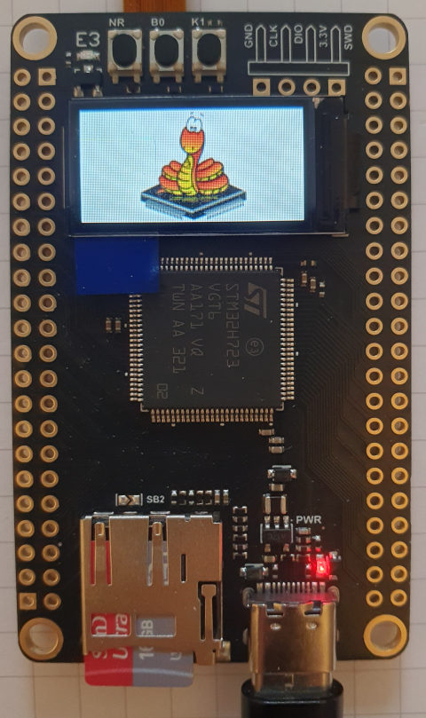

# micropython-board-STM32H723VGT6


Micropython Board Definition for WeAct Studio Board with STM32H723VGT6
[WeActStudio.MiniSTM32H723](https://github.com/WeActStudio/WeActStudio.MiniSTM32H723)


## Current status

> This is work in progess based on micropython v1.21.0 (tagged version, 1.22.0 works too)

SPI flash works in soft spi mode only (both single and quad (octospi)). Octospi needs modification of octospi.c (see patch dir. I also modified stm32h723_af.csv to make it compile. This is just a temporary hack.
To compile on unmodified micropython QSPI Flash has to be disabled (default).

Compiles with v1.25 now, but without QSPI Flash.

Supported features so far:

- working: USB repl, ST7735 TFT Display, LED, user button, SD card, SPI, I2C, ADC 
- should work (not tested): I2C, UART, TIMER, DAC, RTC CAN, RNG
- not working:  I2S, camera 

Firmware build is based on tagged version of micropython v1.21.0 and includes display driver from Russ Hughes with some fonts and brainelectronic's Winbond flash driver to mount SPI flash connected to SPI1 

## Build
You need a working cross compile toolchain for the build, which you can get from the [xPack Project](https://xpack.github.io/dev-tools/arm-none-eabi-gcc/).
I highly recommend reading the official build instructions for [Micropython](https://docs.micropython.org/en/latest/develop/gettingstarted.html#compile-and-build-the-code) before you start.

Instructions to build micropython firmware with display driver in short.
```
git clone https://github.com/micropython/micropython.git
git clone https://github.com/jkorte-dev/micropython-board-STM32H723VGT6
git clone https://github.com/russhughes/st7789_mpy
```
```
cd micropython
git checkout tags/v1.22.0
git submodule update --init
cd lib/micropython-lib/
git checkout tags/v1.22.0
cd ../../mpy-cross/
make
cd ../ports/stm32/
make submodules
ln -s ../../../../micropython-board-STM32H723VGT6/WEACT_H723VG/ .
```
```
make USER_C_MODULES=../../../st7789_mpy BOARD=WEACT_H723VG
```

The experimental build with hardware octospi/qspi flash needs `BOARD_VARIANT=OCTOSPI`
and the modified `octospi.c` from the patch directory.
```
make USER_C_MODULES=../../../st7789_mpy BOARD=WEACT_H723VG BOARD_VARIANT=OCTOSPI
```
dfu-util is required to install the firmware with DFU method, which is described here.

```
brew install dfu-util stlink # mac
sudo apt-get install dfu-util stlink# linux
```

Before you can flash the board you have to put the board into DFU mode:
Press the BOOT0 key and the reset key, then release the reset key, and release the BOOT0 key after 0.5 seconds.
Verify that the board is in DFU mode with:

```
dfu-util -l
```

To install to firmware execute
```
dfu-util -a 0  -D build-WEACT_H723VG/firmware.dfu
```

or if you prefer st-link

```
st-info --probe
st-flash --format ihex write build-WEACT_H723VG/firmware.hex
```


## Credits
credits to:
- The micropython team!
- Russ Hughes for his great and fast display driver (in c) [st7789_mpy]( https://github.com/russhughes/st7789_mpy) 
- brainelectronic for the flash driver [micropython-winbond](https://github.com/brainelectronics/micropython-winbond)
- boochow for the ST7735 display driver (pure python) [MicroPython-ST7735](https://github.com/boochow/MicroPython-ST7735)

## change log
15.01.2024 initial version.
